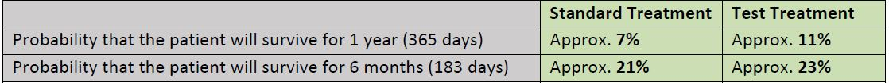
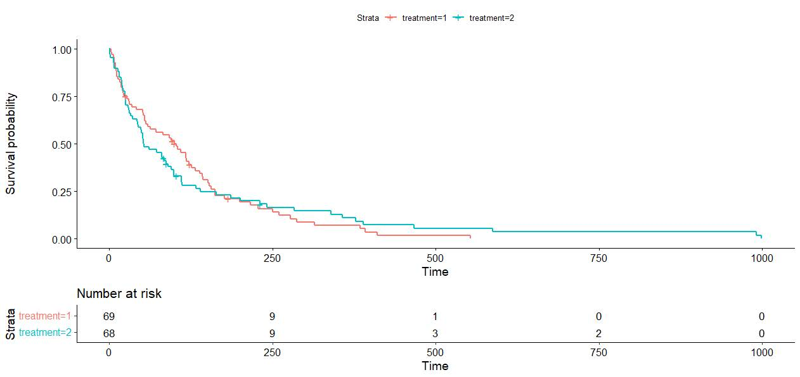
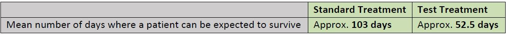
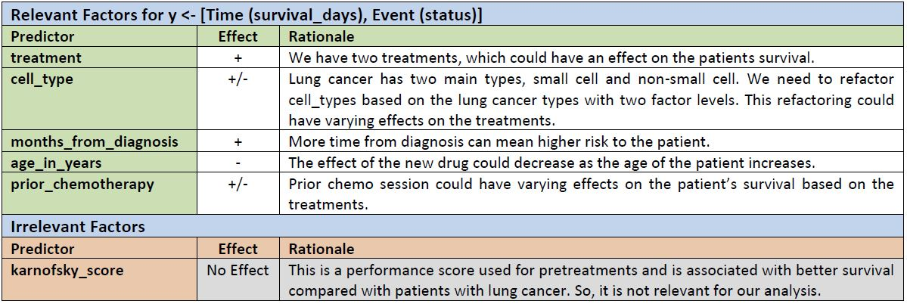
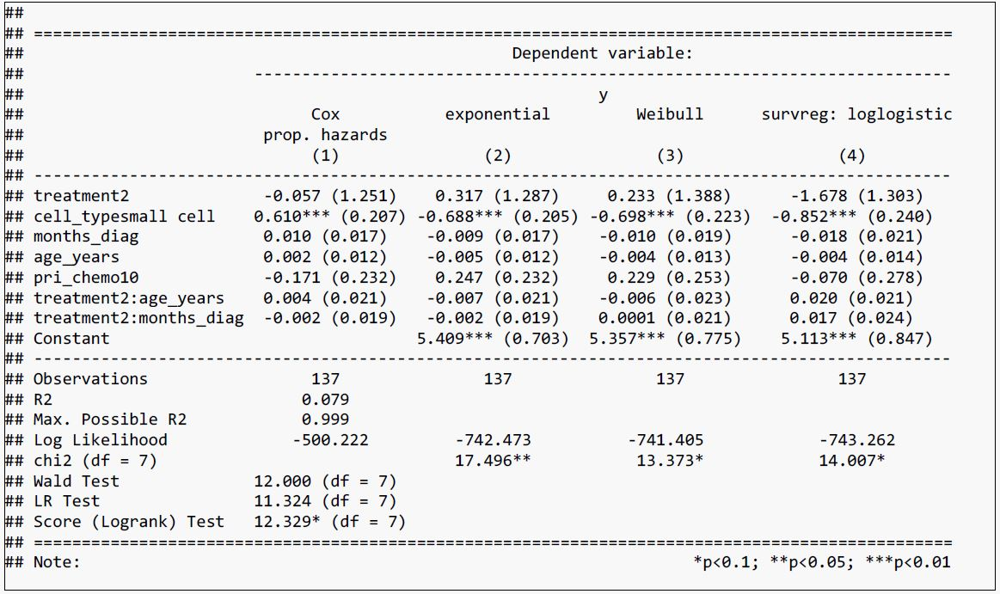
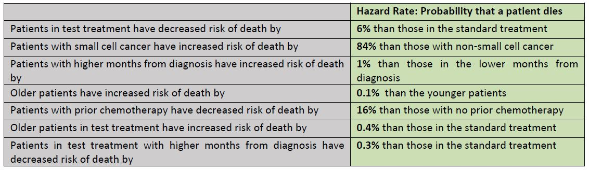
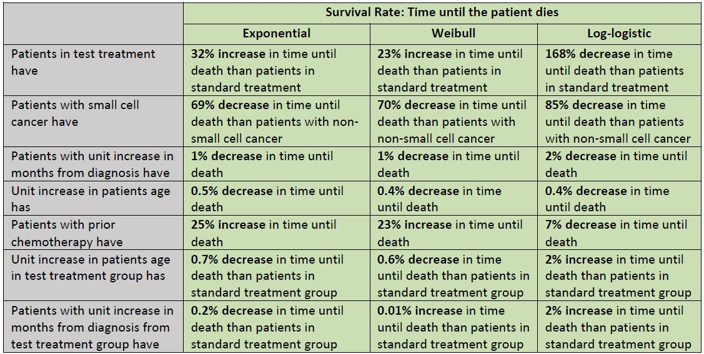

# Patient Survival Analysis

## Problem Statement

The objective is to do survival analysis on the provided dataset.

**Analysis**

1. We would like to see Kaplan-Meier survival graphs for patients with the test vs standard treatment. Use this data to assess.
	- What is the probability that the patient will survive for 1 year (365 days) and 6 months (183 days) on the standard treatment vs the test treatment?
	- What is the mean number of days where a patient can be expected to survive if they are on the standard vs the test treatment?
	
2. Create three semi-parametric and parametric models to estimate the marginal effects of relevant predictors on
survival outcomes. Interpret the coefficients of these models to explain the precise effects of age and months of diagnosis on survival probabilities of patients with standard and test treatments.

## Dataset

Veteran's Administration Lung Cancer Trial 137 patients with advanced, inoperable lung cancer were treated with chemotherapy (standard) or chemotherapy combined with a new drug (test).

Source: Kalbfleisch and Prentice (pp. 223-224)

**Data Dictionary**
- Treatment 1=standard, 2=test
- Cell type 1=squamous, 2=small cell, 3=adeno, 4=large
- Survival in days
- Status 1=dead, 0=censored
- Karnofsky score (measure of general performance, 100=best) 
- Months from Diagnosis 
- Age in years 
- Prior chemotherapy 0=no, 10=yes

## Analysis

### Ask-1

**Question-1**

**Dependent Variables:** Dependent variable for the survival analysis problems is the waiting time until the occurrence of an event. Observations are censored, in the sense that for some cases the event has not yet occurred at the time of analysis. These are predictors whose effect on the waiting time we wish to assess. Which is the survival_days (Time) and status (Event).



Estimated probability could vary within a range of 3-18% (95% CI) for the patients that received the standard treatment and a range of 5-23% (95% CI) for the patients that received the test treatment.

Estimated probability could vary within a range of 13-34% (95% CI) for the patients that received the standard treatment and a range of 15-36% (95% CI) for the patients that received the test treatment.



From our KM analysis, the survival probability of the test treatment group is higher than the standard group for both time periods. But from the plot, both treatments show the same survival probability until the first 15-20 days. Then the standard treatment group has higher survival probability until about 160-175 days. Then the test treatment group has higher survival probability. This means it takes about 175 days to see the effects of the new drug.

**Question-2**



### Ask-2

**Factor Effects**

**Positive Effect:** If there is a direct proportionality (+X then +y / -X then -y) between the predictor variable (X) and the
response variable (y), we can say there is a positive effect.

**Negative Effect:** If there is an inverse proportionality (+X then -y / -X then +y) between the predictor variable (X) and the
response variable (y), we can say there is a negative effect.



**Code Snippet for Stargazer**

```
#Stargazer
stargazer(cox1, exp1, wbl1, llg1, type='text', single.row = TRUE)
```



**_[Selected Model = Cox PH] – [Reason for choosing Semi-Parametric Model Over Parametric Models is that these models assume that there is a constant hazard function which in most cases is unrealistic. So, we decided to go with the Cox PH model as it does not make any assumptions in the hazard (Risk of event occurring) function.]_**

**1. Semi-Parametric Model**

Cox proportional hazard model provides an estimate of the hazard ratio, which is an estimate of the relative risk in the treated group (Standard Treatment) vs the control group (Test Treatment). In other words, we can estimate the hazard rate which is the probability that if the event (status – Patient dead or not-dead) has not already occurred, it will occur in the next time interval (survival_days).



**2. Parametric Models**

Exponential, Weibull, Log-logistic models etc. provide an estimate of the survival rate. As hazard rate and survival rate have opposite slopes, this is reflected in the sign of the estimates in most cases. We get the following insights:



## Conclusion

From the analysis, age and months from diagnosis does not seem to have any significant impact on the hazard rate. However, the type of cancer seems to have a significant effect and could be worth a deeper dive.

However, age and months from diagnosis does not seem to have any significant impact on the survival rate but the type of cancer does.